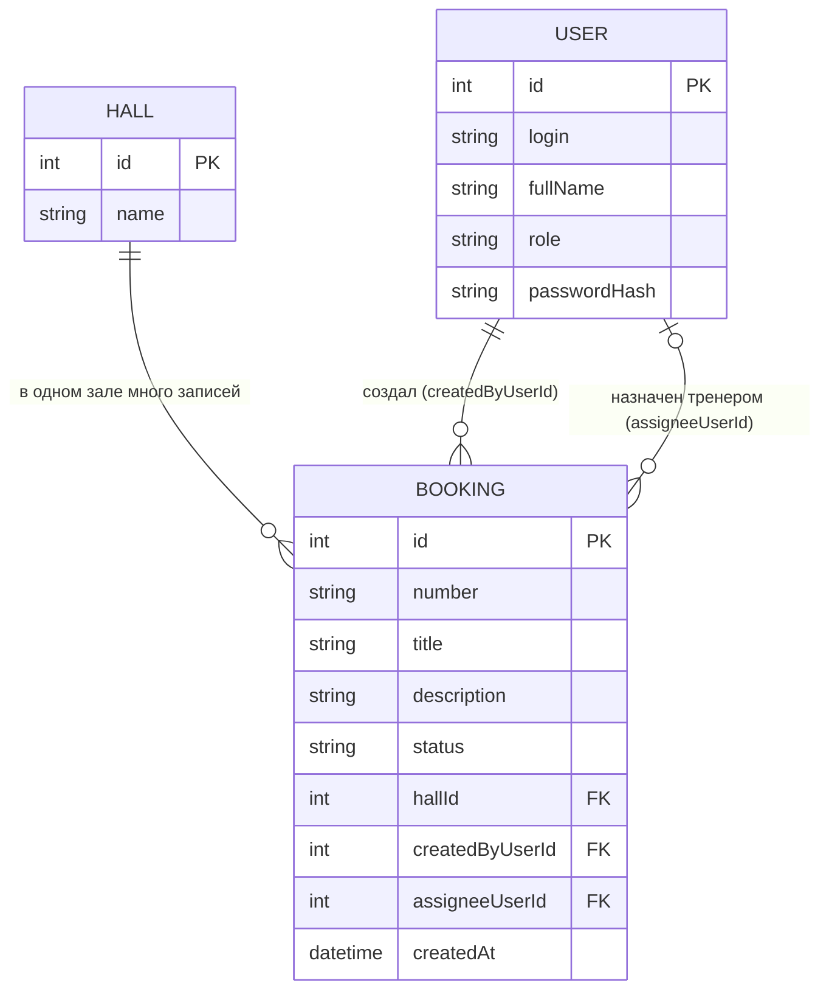

# Модель данных

## Словарь проекта
| Термин курса | Термин моей темы                                        |
| ------------ | ------------------------------------------------------- |
| Ticket       | Booking (запись на тренировку)                          |
| Site         | Hall (зал клуба)                                        |
| User         | User (администратор ресепшн, тренер, управляющий клуба) |

## ER-диаграмма

## Связи словами
- Один зал — много записей на тренировку.
- Один пользователь (администратор) создаёт много записей.
- Один пользователь (тренер) может быть назначен на много записей.
- У новой записи тренера может не быть: assigneeUserId пустой.

## Ключи
- id — машинный первичный ключ (PK), число.
- number — человеческий номер записи (например, БР-0017), не замена id.
- hallId — внешний ключ (FK) на Hall.
- createdByUserId, assigneeUserId — внешние ключи (FK) на User.

## Статусы
Только четыре кода: New, InProgress, Closed, Cancelled. Допустимые переходы: New → InProgress, New → Cancelled, InProgress → Closed, InProgress → Cancelled. Отмена — статус Cancelled, строка не удаляется.

## Проверка 3НФ
Название зала хранится в сущности Hall один раз. Booking содержит внешний ключ hallId. При переименовании зала меняется одна строка, поэтому текст названия не дублируется в записях. Тренер хранится в User, а в Booking лежит только его id.